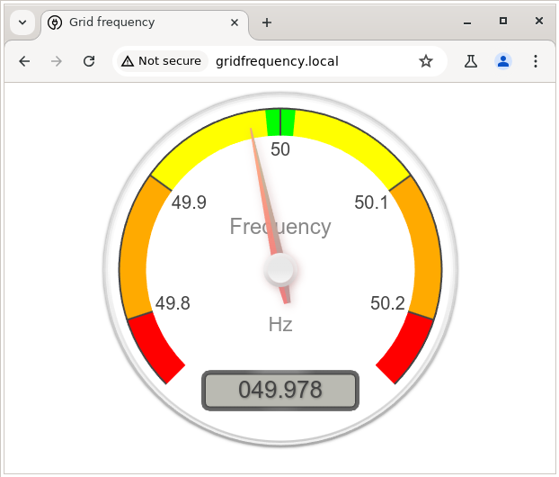
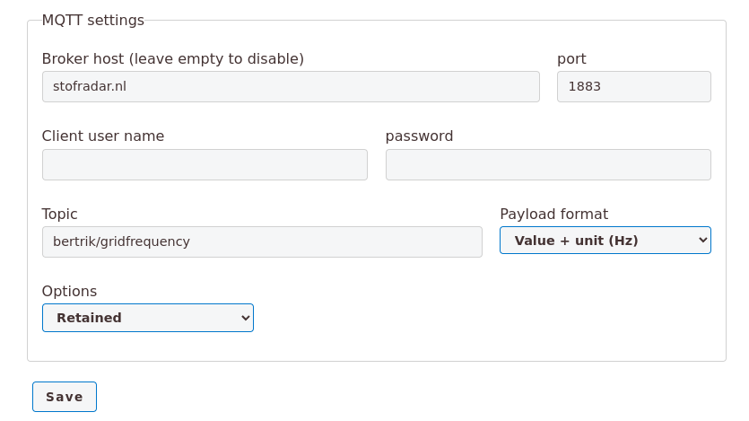

# GridFrequency
Arduino project to measure mains/grid frequency and publish it as SSE and MQTT streams with display on an internal web server

## Introduction
This Arduino software allows you to measure the mains grid frequency (nominally 50 Hz) to high resolution (1 mHz)
and display the frequency on a web page served from an internal web server.



### Future
Plans for the future are:
* add support for sending measurements over MQTT
* display instantaneous phase measurement
* display not just instantaneous frequency but also little graphs over time

## Design
This project is the result of various iterations of trying to build a simple device to measure mains frequency.
So far this is the simplest hardware design, coupled with the most accurate software algorithm.

The algorithm samples a floating ADC input during 1 second, picking up the ambient mains 'hum'.
While sampling, the measured waveform is correlated with a 'perfect' reference 50 Hz quadrature waveform.
This gives an I and Q value from which the relative phase between the measured waveform and the reference waveform can be determined.
Small frequency deviations in the actual mains waveform cause this phase to shift over time.
From this shift, the instantaneous frequency of the measured waveform is derived each second.

The measured frequency values are published on /events as server-sent events (SSE).
The internal web server serves a web page with javascript that connects an event source to this SSE stream.
The instantaneous value is visualized as a gauge using [canvas-gauges](https://canvas-gauges.com) by Mykhailo Stadnyk.

## Hardware
The hardware consists of a Luatos ESP32-C3 board:
https://wiki.luatos.org/chips/esp32c3/board.html

No connection to the mains is required. The mains signal is picked up from the ambient electric field of mains "hum" on an unconnected ADC input of the ESP chip.

This board was chosen because it is inexpensive, has a relatively stable and accurate clock crystal and has ADC inputs that are 'floating'.

## Software

### Building
This project is built using platformio.

One time steps for Debian:
* Use apt to install python3 and python3-pip:
```
sudo apt update
sudo apt install python3 python3-pip
```
* Clone this archive using git:
```
git clone https://github.com/bertrik/GridFrequency
cd GridFrequency
```
* Create a python virtual environment
```
python3 -m venv .venv
```
* Activate the python virtual environment and install platformio:
```
source .venv/bin/activate
pip install platformio
```

To build the program:
* Activate the python virtual environment, if you haven't already in the steps above:
```
source .venv/bin/activate
```
* Compile the program:
```
pio run
```
Platformio will install the required build tools and libraries automatically (and cache them for later use).
When finished, you should see a message indicating a successful build and some info about RAM and flash usage.

### Flashing
To flash the board:
* Connect the board using a USB-C cable to your computer
* You might need to add yourself to the 'dialout' group, then log in again:
> ...
* Upload the program plus its web server files:
```
pio run -t upload
```

### Running
When running for the first time, no WiFi connection has been set up. The sofware will create its own WiFi access point.
Connect to this (no password) and browse to http://192.168.4.1 to choose a network to connect to,
enter the WiFi password and press save. The board should reboot and automatically connect to your WiFi from now on.

When it has successfully connected to the WiFi network, the LED starts flashing slowy, 1 second on, 1 second off.

You can view frequency measurements by browsing to http://gridfrequency.local

#### MQTT configuration
Measurements can also be sent to an MQTT server.
To configure MQTT, browse to http://gridfrequency.local/config



Entering a broker host enables sending to MQTT, leaving it empty disables it.
User name and password can be left empty, the topic is mandatory.
With the 'append unit' option, measurements are published as '50.000 Hz', otherwise just a number like '50.000'.
